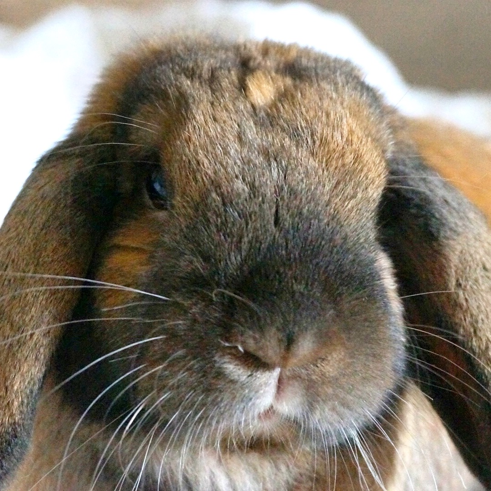

# CroudFarming

In the beginning was a rabbit, and the rabbit name is Vader...

### This is he

And the only thing he loves more than the Death Star is eating green salad leafes. So we need your help to give him what he wants and that's why we've created this project.

We've created a growbox for growing salad with a bunch of sensors and switches, and a cam, of course, because everything becomes better if you can live streaming it. That's what we get on our side and you get the [Messenger bot](https://www.facebook.com/Green-Bot-Messenger-196489871202541/) to give your thoughts about the better way to growing the most delicious salad in the world to make Vaide happy. 

### How it works

The growbox if fully automated and isolated from the world and the only way to change something inside it is to make your vote through the [Messenger bot](https://www.facebook.com/Green-Bot-Messenger-196489871202541/). But to make a more informed decision you need to check the current state inside, to do it you can ask bot to show you the latest sensor data from the growbox and it gives you current temp, humidity, light etc. (we are connecting more and more sesnsors all the time). 

After that you can choose one of the predefined actions, for example, give more light or less light, or maybe more water and so on. Also you can check the process of the voting, get the live polls and change your revote if you want.

Everyt hour voting ends and the action that have the largest amout of votes performed and you can see the livestream of the action on lthe Facebook page of our project. After that process starts over and you can check the data and vote again.
